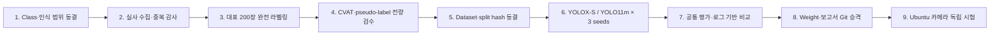

# MCU Vision — YOLOX-S / YOLO11m 실험 작업공간

Windows에서 MCU·소형 전자부품 detector를 학습하고, 로그·수치·가중치를 공개 GitHub에 재현 가능하게
보존한 뒤 Ubuntu 카메라 환경에서 검증하기 위한 저장소입니다. 프로젝트 공개본은 `AGPL-3.0`이며
third-party model·dataset에는 각 원 라이선스가 함께 적용됩니다.

> **현재 판정 (2026-08-18):** Raspberry Pi **1-class bootstrap**의 6-run 계획 중 3개는 100 epoch
> 완료, YOLOX-S seed43은 70/100에서 중단, seed44 두 run은 미시작입니다. 현재 가중치는
> [공개 진행본](reports/progress/rpi_bootstrap_2026-08-18/README.md)이며 정식 release나 STM32/SMD 모델이
> 아닙니다. MCU/SMD 승인 데이터와 독립 컨베이어 test도 아직 없습니다.

## 진행상황 대시보드

| 영역 | 현재 확인값 | 판정 | 완료 조건 |
|---|---|---|---|
| Windows 학습 환경 | RTX 5060 Laptop 8,151 MiB, PyTorch 2.12.1+cu130 | **PASS** | 환경 lock과 smoke 유지 |
| YOLO11 / YOLOX 배선 | 두 framework CUDA smoke, 로그·공통 평가 구현 | **PASS** | full run에서 재확인 |
| Raspberry Pi bootstrap | train/val/test 1,500/195/180; condition overlap 0; cross-split pHash 후보 0/3,511 | **PASS (bootstrap)** | 새 실물·새 카메라 독립 test |
| MCU/SMD class 정의 | 5개 provisional class | **PARTIAL** | detector/OCR 범위와 제외 규칙 동결 |
| Multi-class 학습 경로 | dataset CLI·YOLOX dynamic class 수·YOLO↔COCO fail-fast 구현 | **PARTIAL** | 실제 multi-class 승인 데이터 smoke |
| 소형 SMD 실제 데이터 | 승인된 canonical dataset 0장 | **NOT VERIFIED** | provenance·specimen ID가 있는 승인 실사 확보 |
| 오토라벨 | YOLO11 tiled `pending` proposal까지 구현 | **PARTIAL** | CVAT round-trip·reviewer/hash 승인 gate |
| RPi full 학습 | COMPLETE 3/6, INTERRUPTED 1/6, 미시작 2/6 | **PARTIAL** | 2 models × 3 seeds × 100 epochs 완료 |
| 정식 모델 비교 | 완료 matrix 부족으로 `release_ready=false` | **NOT VERIFIED** | 6-run protocol PASS 및 mean ± SD |
| 공개 진행 가중치 | 완료 best 3개 + 중단 best/resume 2개를 LFS에 선별 | **INTERIM_PROGRESS** | formal comparison·ONNX·독립 test 후 `weights/trained` 승격 |
| Ubuntu 카메라 시험 | 문서만 준비 | **NOT VERIFIED** | 새 촬영 session에서 정확도·latency·FPS 측정 |

상세 근거는 [현재 프로젝트 상태](docs/project_status.md)와 [전체 로드맵](docs/roadmap.md)에 있습니다.

## 전체 진행 흐름



현재 multi-class 핵심 병목은 **1–4단계**입니다. Raspberry Pi 1-class로 파이프라인을 검증하는 작업과 실제
STM32/SMD 데이터를 준비하는 작업은 병행할 수 있지만, 정식 multi-class 결과는 class·라벨·split을
동결한 뒤에만 만듭니다.

## 바로 다음 작업

| 순서 | 작업 | 종료 조건 |
|---:|---|---|
| 1 | 검출·인식 범위 확정 | 보드/패키지 검출과 marking OCR·SKU 분류를 구분한 class 규정 승인 |
| 2 | RPi bootstrap 3-seed 학습 재개 | YOLOX-S seed43 100 epoch, seed44 두 모델 완료 |
| 3 | STM32·Pico·소형 SMD 수집 및 자체 촬영 | source/license/specimen/session ID와 중복 감사 결과 확보 |
| 4 | 대표 200장 완전 라벨링 | 각 이미지에 보이는 모든 target instance 승인, locked gold validation 별도 생성 |
| 5 | CVAT round-trip과 pseudo-label 검수 | import/export 손실 0, `pending`을 사람이 전량 수정·승인 |
| 6 | 입력 조건 pilot | `640 full-frame` vs `640 tile`, 필요 시 `960`을 validation으로 비교 |
| 7 | 정식 비교 | seed 42/43/44 각 100 epochs, `release_ready=true`와 mean ± sample SD 생성 |
| 8 | Git 승격·Ubuntu 시험 | checkpoint hash·ONNX 동등성 확인 후 실제 카메라 test |

## 핵심 수치와 선정 이유

아래 값은 재현 가능한 **1차 baseline**이지 MCU/SMD의 최적값이 아닙니다.

| 항목 | 기준값 | 선정 이유 | 현재 검증·재조정 조건 |
|---|---:|---|---|
| 입력 크기 | `640×640` | 두 모델 공통 입력, 현재 8 GB GPU에서 batch 8 실행 | CUDA smoke PASS; 전처리 후 bbox pixel-size/bin recall 또는 `AP_small`이 낮으면 tiling·960/1280 비교 |
| micro-batch | `8` | 두 framework에서 공통 실행 가능한 VRAM 기준값 | 장시간 peak VRAM·온도 미검증; effective batch는 framework별로 다름 |
| DataLoader workers | `0` | 16 GB Windows 장치에서 subprocess RAM·paging 위험 최소화 | 전용 RAM이 충분하면 workers 1/2 처리량 pilot |
| epochs | `100` | 같은 epoch/data-exposure의 첫 비교 | 동일 compute budget은 아님; AP plateau·overfit에 따라 새 protocol로 조정 |
| seeds | `42, 43, 44` | 단일 운 좋은 run의 영향을 줄이는 최소 반복 | 차이가 sample SD와 비슷하면 5회 이상 |
| precision | AMP | VRAM·시간 절감 | 두 smoke PASS; NaN/overflow 시 동일 조건 FP32 control |
| 주 정확도 | `COCO AP50-95` | 여러 IoU에서 위치 정확도를 함께 보는 표준 지표 | AP50/AP75/AP_small/AR100도 병기 |
| 보고 confidence | `0.25` | 같은 운영점의 P/R/F1 비교용 | 배포값 아님; gold validation에서 선택 후 test 전에 동결 |
| NMS / match IoU | `0.65 / 0.50` | 두 exporter의 numeric 조건과 운영점 matcher 통일 | 실제 밀집 SMD에서 tile 경계·겹침 검증 필요 |
| RPi split | `1500/195/180` | 동일 condition과 pHash-connected 후보를 split 밖으로 넘기지 않음 | physical item ID가 없어 Ubuntu 새 카메라 test 필요 |

- [14개 수치의 선정 이유·최적값 여부·조정 조건](reports/methodology/parameter_rationale.md)
- [학습 알고리즘·논문·공식 source를 포함한 전체 방법론](reports/methodology/experiment_methodology.md)
- [실행값의 단일 원본 YAML](configs/experiments/baseline_v1.yaml)

## 처음 실행

별도 CUDA Toolkit은 현재 PyTorch 학습에 필요하지 않습니다. PyTorch CUDA wheel과 NVIDIA driver로
검증했으며, `nvcc` custom build 또는 목표 TensorRT toolchain이 필요할 때만 추가 검토합니다.

```powershell
git lfs install
git lfs pull
Set-ExecutionPolicy -Scope Process Bypass
.\scripts\setup_collection.ps1
.\scripts\setup_yolo11.ps1
.\scripts\setup_yolox.ps1
.\.venv-collect\Scripts\python.exe -m pytest
```

이후 [Windows 재현 절차](docs/reproducibility_windows.md)의 dataset 생성·동등성 검증을 먼저 완료합니다.
Smoke는 그 다음의 배선 확인용입니다. 현재 RPi 1-class full 3-seed campaign을 실행할 때는 다음 명령을
사용하며, multi-class 정식 학습 명령으로 해석하면 안 됩니다.

```powershell
.\scripts\run_compare_seeds.ps1 -Epochs 100 -Batch 8 -ImageSize 640
```

Fresh clone부터 3-seed 실행·승격까지는 [Windows 재현 절차](docs/reproducibility_windows.md)를 따릅니다.

## 결과와 증빙 원칙

| 결과 항목 | 현재 상태 |
|---|---|
| full run | YOLO11m seed42/43, YOLOX-S seed42 완료 |
| interrupted run | YOLOX-S seed43 epoch 70; best·resume checkpoint 보존 |
| 공개 progress report | [`reports/progress/rpi_bootstrap_2026-08-18`](reports/progress/rpi_bootstrap_2026-08-18/README.md) |
| 정식 3-seed comparison | matrix 미완료로 없음 |
| smoke comparison | 배선 검증용; 모델 우열 판단 금지 |
| progress weight | [`weights/progress/rpi_bootstrap_2026-08-18`](weights/progress/rpi_bootstrap_2026-08-18/README.md) |
| promoted trained weight | 없음 (`release_ready=false`) |
| 독립 컨베이어 test | 없음 |
| Git에 보존된 증빙 | protocol/config, 환경, 데이터 manifest, 방법론, 비식별 학습 로그·수치·그래프·checkpoint SHA |

판단 원본은 `terminal.log`, CSV, JSON, checkpoint SHA-256입니다. 보고서 PNG는 이 숫자를 Python
`matplotlib`로 그린 **비생성형 파생물**이며 AI가 지어낸 이미지가 아닙니다. `terminal_summary.png`도
실제 모니터 사진이 아니라 `comparison_terminal.txt`의 글자를 그대로 렌더링한 이미지입니다.
공개 progress 그래프는 full/interrupted run에서 나온 실제 로그 기반 자료이며 smoke 그래프가 아닙니다.
다만 6-run 정식 비교가 아니므로 모델 우열의 최종 결론으로 게시하지 않습니다.

## 문서 지도

| 궁금한 내용 | 문서 |
|---|---|
| 지금 어디까지 됐고 다음 gate는 무엇인가? | [프로젝트 상태](docs/project_status.md) · [전체 로드맵](docs/roadmap.md) |
| Windows에서 어떻게 재현하는가? | [Windows 재현 절차](docs/reproducibility_windows.md) |
| 왜 이 수치와 알고리즘을 썼는가? | [핵심 수치 근거](reports/methodology/parameter_rationale.md) · [전체 방법론](reports/methodology/experiment_methodology.md) |
| 데이터와 라벨을 어떻게 관리하는가? | [데이터 계획](docs/data_plan.md) · [라벨링 규정](docs/annotation_protocol.md) |
| RPi split과 YOLO/COCO 일치 근거는? | [누수 방지 split](docs/condition_split.md) · [형식 동등성 gate](docs/dataset_equivalence.md) |
| 결과를 어떻게 증빙·Ubuntu로 넘기는가? | [증빙 정책](docs/evidence_and_results_policy.md) · [Ubuntu 인계](docs/ubuntu_handoff.md) |
| 전체 문서는 어디에 있는가? | [문서 안내](docs/README.md) · [Reports](reports/README.md) |

## 저장·라이선스 경계

- 코드·config·manifest·평가 수치: 일반 Git
- `*.pt`, `*.pth`, `*.onnx`: Git LFS
- 원본 이미지·미승인 라벨·전체 `runs/`: Git 제외
- TensorRT `.engine`: Ubuntu 목표 장비에서 생성하고 Git 제외
- 공개 저장소의 project code: `AGPL-3.0`; YOLOX·dataset 등 third-party 조건은 별도 유지

세부 조건은 [Third-party notices](THIRD_PARTY_NOTICES.md)를 확인합니다.
