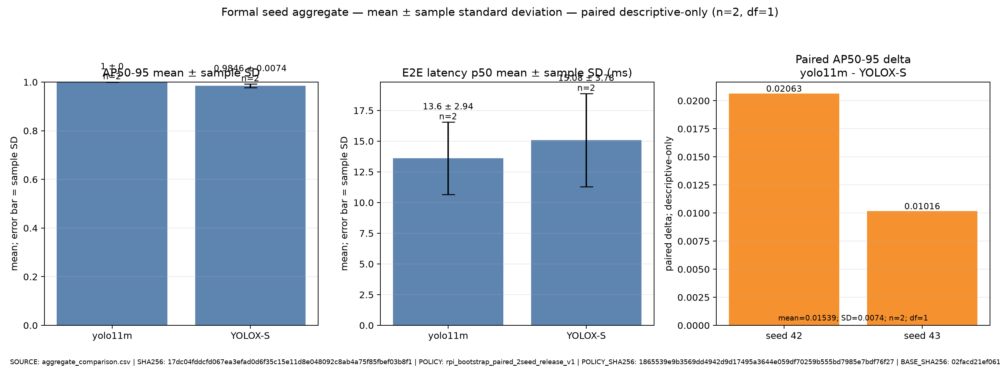

# MCU detector 실험 결과

- protocol 판정: **PASS**
- 정식 release 판정: **PASS**
- AP/AR 출처: 두 framework prediction을 동일 `pycocotools==2.0.11` COCOeval로 재계산
- 운영점 P/R/F1 출처: 공통 score-sorted class-aware greedy 1:1 matcher
- 범위: validation 결과이며 독립적인 실제 컨베이어-camera test 결과가 아님
- 비교 성격: framework-native recipe의 실사용 system benchmark; 순수 architecture ablation이 아님

- **FORMAL EXECUTION STATUS: PASS — 2 models × 2 paired seeds × 100 epochs — descriptive-only**
- 실행 근거: [formal execution status](formal_execution_status.json) · [immutable protocol snapshot](protocol_snapshot.yaml) · [Ubuntu handoff](ubuntu_handoff.md)

## Formal release policy

- policy ID: `rpi_bootstrap_paired_2seed_release_v1`
- policy SHA-256: `1865539e9b3569dd4942d9d17495a3644e059df70259b555bd7985e7bdf76f27`
- base protocol: `micropcb_rpi_phash_component_bootstrap_v2` / `02facd21ef061fc6530c064d4397ab82e36af3e0601cb502d46f7a6ec34f46f5`
- evidence tier: `paired_2seed_descriptive`
- exact matrix: `[['yolo11m', 42], ['yolo11m', 43], ['YOLOX-S', 42], ['YOLOX-S', 43]]`
- statistics: `n=2`, `df=1`, `descriptive-only`
- 이 2-seed 범위는 학습 시작 후 계산 비용을 고려해 결정되었습니다. seed44는 완료 여부와 관계없이 두 모델 모두에서 일괄 제외합니다.
- 허용: per-run 수치, mean, sample SD, paired seed delta. 금지: 통계적 유의성, 모집단 우월성, production-ready, independent-test 주장.
- 동결 정책: [formal release policy](formal_release_policy.yaml)

## 공통 평가표

| 모델 | seed | run_id | AP50-95 | AP50 | AP75 | APsmall | AR100 | P | R | F1 | TP/FP/FN | p50/p95 ms | FPS | VRAM MiB |
|---|---:|---|---:|---:|---:|---:|---:|---:|---:|---:|---:|---:|---:|---:|
| yolo11m | 42 | yolo11m_seed42 | 1.0000 | 1.0000 | 1.0000 | - | 1.0000 | 1.0000 | 1.0000 | 1.0000 | 195/0/0 | 15.68/16.96 | 64.13 | 3999.2 |
| yolo11m | 43 | yolo11m_seed43 | 1.0000 | 1.0000 | 1.0000 | - | 1.0000 | 1.0000 | 1.0000 | 1.0000 | 195/0/0 | 11.52/12.46 | 84.92 | 3999.2 |
| YOLOX-S | 42 | yolox_s_seed42 | 0.9794 | 1.0000 | 1.0000 | - | 0.9846 | 1.0000 | 1.0000 | 1.0000 | 195/0/0 | 17.76/20.05 | 56.43 | 1717.1 |
| YOLOX-S | 43 | yolox_s_seed43 | 0.9898 | 1.0000 | 1.0000 | - | 0.9913 | 1.0000 | 1.0000 | 1.0000 | 195/0/0 | 12.41/13.47 | 79.34 | 1716.7 |

## 해석 규칙

- 주 정확도 지표는 AP50-95이며, 소형 칩에서는 APsmall과 resize 후 box pixel 분포를 함께 봅니다.
- confidence=0.25의 P/R/F1은 고정 보고점이지 최종 배포 threshold가 아닙니다.
- YOLO11 `box/cls/dfl`과 YOLOX `iou/conf/cls/l1` loss는 정의가 달라 절대값을 직접 비교하지 않습니다.
- YOLO11의 gradient accumulation과 YOLOX의 batch별 optimizer step이 달라 optimizer dynamics는 동일하지 않습니다.
- 모델 차이가 seed 표준편차와 비슷하면 현재 반복 수로 우열을 확정하지 않고 반복 수를 늘립니다.

## Seed 집계

| 모델 | n | AP50-95 mean ± sample SD | p50 latency mean ± sample SD (ms) |
|---|---:|---:|---:|
| yolo11m | 2 | 1.0000 ± 0.0000 | 13.60 ± 2.94 |
| YOLOX-S | 2 | 0.9846 ± 0.0074 | 15.08 ± 3.78 |

## Paired seed delta (descriptive-only)

방향: `yolo11m - YOLOX-S`; n=2, df=1

| seed | model A AP50-95 | model B AP50-95 | paired delta |
|---:|---:|---:|---:|
| 42 | 1.0000 | 0.9794 | 0.0206 |
| 43 | 1.0000 | 0.9898 | 0.0102 |

mean paired delta = `0.0154`, sample SD = `0.0074`. 이 값은 기술통계이며 유의성 검정이나 모집단 우월성의 근거가 아닙니다.

## 자동 생성 증빙

- `comparison.csv/json`: 표의 원본 수치
- `aggregate_comparison.csv/json`: seed 평균·sample SD
- `aggregate_comparison.png`: 모델별 seed 평균과 sample SD error bar
- `comparison_terminal.txt`: 실제 CLI가 출력한 것과 동일한 터미널 표 원문
- `comparison_dashboard.png`, `training_curves.png`: 로그/CSV를 matplotlib로 그린 비생성형 그래프
- `terminal_summary.png`: `comparison_terminal.txt`를 그대로 코드 렌더링한 이미지이며 화면 캡처가 아님
- `evidence_manifest.json`: 원본 로그·CSV와 각 이미지의 SHA-256 및 `generative_ai_used_for_images=false` 기록
- `protocol_rationale.csv/png`, `experiment_methodology.md`: 수치 선정 이유와 출처
