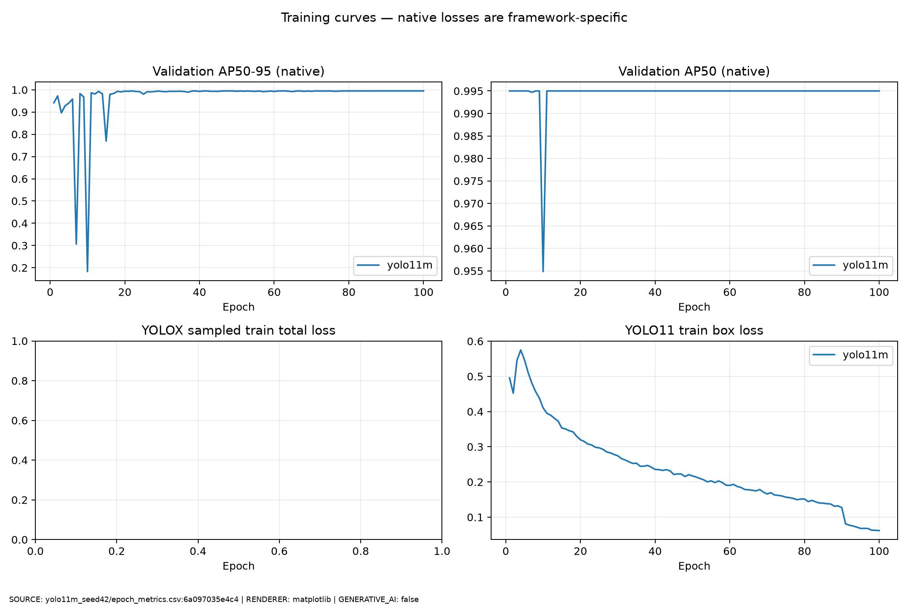
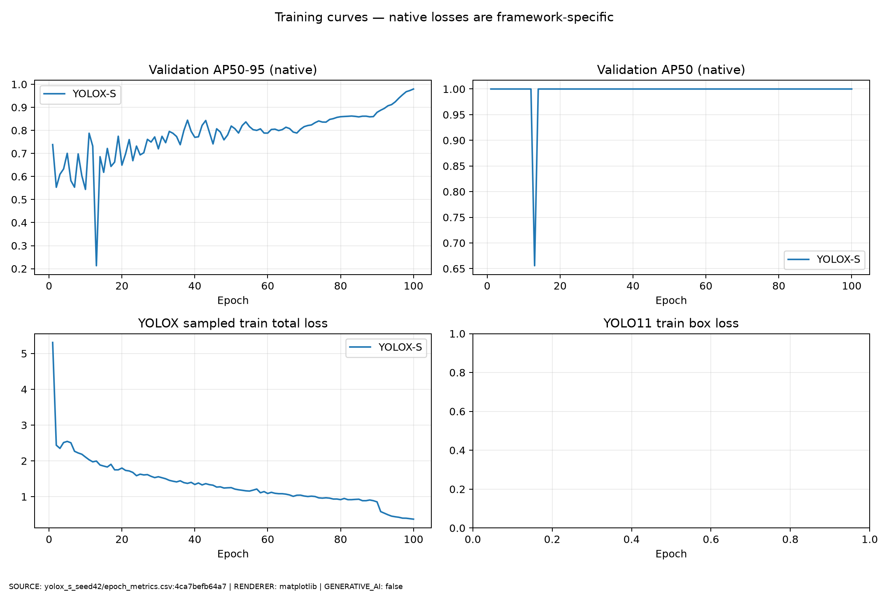
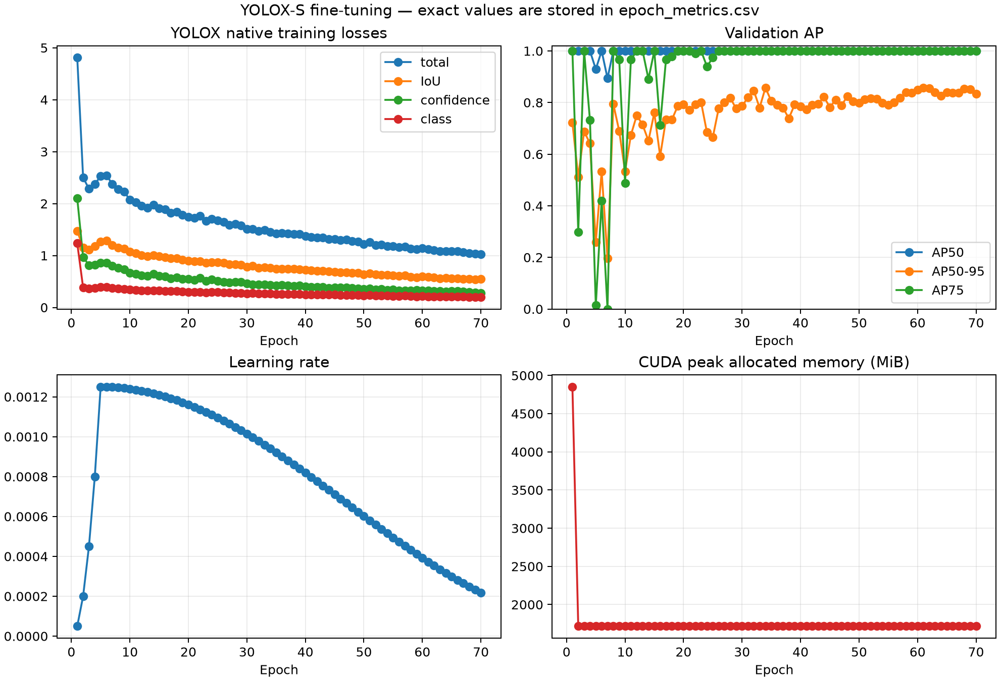

# Raspberry Pi 1-class 학습 진행본 — 2026-08-18

> **INTERIM_PROGRESS · NOT_FORMAL_RELEASE · NOT_INDEPENDENT_TESTED**
>
> 이 결과는 Raspberry Pi SBC **1-class bootstrap** 전용입니다. STM32, Raspberry Pi Pico,
> loose SMD, top-mark OCR 또는 5-class 모델의 결과가 아닙니다.

## 한눈에 보기

계획한 `2 models × 3 seeds × 100 epochs` 중 완료 run은 3/6입니다. YOLOX-S seed43은
70/100 epoch에서 사용자가 중단했으며, seed44 두 run은 시작하지 않았습니다.

| Run | 상태 | 평가 출처 | AP50-95 | AP50 | P/R/F1 @ conf 0.25 | FP16 e2e p50/p95 | FPS |
|---|---:|---|---:|---:|---:|---:|---:|
| YOLO11m seed42 | COMPLETE 100/100 | common COCO val | 1.000000 | 1.000000 | 1/1/1 | 15.68/16.96 ms | 64.13 |
| YOLO11m seed43 | COMPLETE 100/100 | common COCO val | 1.000000 | 1.000000 | 1/1/1 | 11.52/12.46 ms | 84.92 |
| YOLOX-S seed42 | COMPLETE 100/100 | common COCO val | 0.979373 | 1.000000 | 1/1/1 | 17.76/20.05 ms | 56.43 |
| YOLOX-S seed43 | INTERRUPTED 70/100 | native val | best 0.857410 (epoch 34) | 1.000000 | 미산출 | 미산출 | 미산출 |

중단 run의 epoch 70 native AP50-95는 `0.834207`, AR100은 `0.853333`입니다. 이 값은
완료 run의 common final evaluator 결과가 아니므로 같은 열에서 모델 우열을 판단하면 안 됩니다.
전체 정밀 수치는 [`results.csv`](results.csv), hash chain은
[`progress_manifest.json`](progress_manifest.json)에 있습니다.

Fresh clone에서 전체 공개 파일·가중치 hash를 한 번에 확인할 수 있습니다.

```powershell
.\.venv-collect\Scripts\python.exe .\scripts\verify_progress_snapshot.py `
  --report-dir reports\progress\rpi_bootstrap_2026-08-18
```

## 모델별 설명

### YOLO11m

- Framework: Ultralytics `8.4.120`
- 규모: `20,114,688 parameters`, `68.643 GFLOPs` (`1×3×640×640` 기준)
- 학습: official COCO pretrained `yolo11m.pt`에서 전체 trainable weight fine-tuning,
  SGD, AMP, batch 8, 100 epochs
- 장점 후보: 현재 validation에서 높은 box localization AP와 빠른 실측 latency
- 주의: seed42/43 latency 차이가 커서 laptop 열·전력·background load 영향을 포함합니다.
  또한 Ultralytics의 gradient accumulation/optimizer dynamics는 YOLOX와 다릅니다.
- License: pretrained/fine-tuned model과 Ultralytics 사용 코드는 기본적으로 `AGPL-3.0` 적용

### YOLOX-S

- Framework: YOLOX `0.3.0`, commit `6ddff482...`
- 구조: anchor-free detector, decoupled head, SimOTA label assignment
- 규모: `8,937,682 parameters`, `26.76 GFLOPs`
- 학습: official COCO pretrained YOLOX-S에서 class-specific output conv 6개는 재초기화하고
  호환 tensor는 전이, SGD Nesterov, AMP, batch 8, 100 epochs 계획
- 장점 후보: YOLO11m보다 작은 parameter/FLOPs와 낮은 학습 allocator peak
  (`~1,717 MiB` vs `~3,999 MiB`)
- 주의: YOLOX loss(IoU/conf/cls/L1)와 YOLO11 loss(box/cls/DFL)는 정의가 달라 절대값을
  서로 비교하지 않습니다.
- License: `Apache-2.0`

학습 알고리즘과 하이퍼파라미터 선정 근거는
[`../../methodology/experiment_methodology.md`](../../methodology/experiment_methodology.md)와
[`../../methodology/parameter_rationale.md`](../../methodology/parameter_rationale.md)에 정리했습니다.

## 데이터와 평가 경계

| 항목 | 값 | 판정 |
|---|---:|---|
| Dataset | Adam Byerly, [micro-PCB Images](https://www.kaggle.com/datasets/frettapper/micropcb-images) | CC BY 4.0 |
| 사용 class | `raspberry_pi_sbc` 1개 | CONFIRMED |
| 사용 이미지 | Raspberry Pi 1 B+, 3 B+, A+ 합계 1,875장 | CONFIRMED |
| train/val/test | 1,500/195/180 | CONFIRMED |
| condition/pHash component cross-split | 0 | PASS |
| physical specimen independence | source ID 부족 | NOT VERIFIED |
| Ubuntu 새 카메라 test | 미실행 | NOT VERIFIED |

원본·processed image, prediction box JSON, train/val batch JPG는 공개 snapshot에서 제외했습니다.
데이터 변경 사항은 bbox 변환, pHash-connected split, resize/augmentation 및 detector 학습입니다.

## 공개 가중치

| 파일 | 용도 | 상태 | Public SHA-256 |
|---|---|---|---|
| [`yolo11m_seed42_best.pt`](../../../weights/progress/rpi_bootstrap_2026-08-18/yolo11m_seed42_best.pt) | inference 후보 | COMPLETE | `f48e6e662190f0fd650ca55767cc4e32b18803a9ce3ebec240e51e2f54df5a28` |
| [`yolo11m_seed43_best.pt`](../../../weights/progress/rpi_bootstrap_2026-08-18/yolo11m_seed43_best.pt) | inference 후보 | COMPLETE | `901b8609ab93b4ed727912bf32f490acabbb397e20bef3ffd30e01b2f8de34ab` |
| [`yolox_s_seed42_best.pth`](../../../weights/progress/rpi_bootstrap_2026-08-18/yolox_s_seed42_best.pth) | inference 후보 | COMPLETE | `345ae7b7d54f49a447d3c6ab5c57d202c5593451a41678440c2ea72e94fb0538` |
| [`yolox_s_seed43_best.pth`](../../../weights/progress/rpi_bootstrap_2026-08-18/yolox_s_seed43_best.pth) | epoch 34 best | INTERRUPTED | `ca85c3eb17cbf0619f2345f0547ae67fc7c34f1a81d15db365fd6dff49f31c3b` |
| [`yolox_s_seed43_resume_epoch_70.pth`](../../../weights/progress/rpi_bootstrap_2026-08-18/yolox_s_seed43_resume_epoch_70.pth) | epoch 70 resume candidate | INTERRUPTED | `9783f59224fba8c6bc880ef7cfd553235638686c83e970ad7a6c20d9cdb85dfd` |

YOLO11 공개본은 원본 tensor를 bit-for-bit 비교하고 zero-input forward 결과
`max_abs_difference=0`, Ultralytics load `PASS`를 확인한 뒤 로컬 Windows 경로 metadata만 제거했습니다.
그래서 원본 checkpoint와 공개본 SHA는 다르며 두 SHA가 manifest에 함께 기록됩니다. YOLOX 공개본은
원본과 byte-identical이며 세 파일 모두 pinned YOLOX config에 `strict=True` model load `PASS`를
확인했습니다.

PyTorch checkpoint는 pickle 기반이므로 출처가 불명확한 파일을 임의로 로드하지 말고, 이 표 또는
manifest의 SHA-256을 먼저 확인하십시오. 사용 예시는
[`weights/progress/rpi_bootstrap_2026-08-18/README.md`](../../../weights/progress/rpi_bootstrap_2026-08-18/README.md)에 있습니다.

## 로그와 그래프의 출처

아래 이미지는 ImageGen 등 생성형 AI가 만든 결과가 아닙니다. 실제 `terminal.log`,
`epoch_metrics.csv`, `final_metrics.json`을 `matplotlib 3.11.1`로 결정론적으로 렌더링한 파생물입니다.
`terminal_summary.png`는 **실제 모니터 스크린샷이 아니라** 터미널 표를 그대로 렌더링한 이미지입니다.
판정 원본은 공개 CSV/JSON/비식별 로그이며, 로컬 경로와 NVIDIA process/PID 표만 제거하고 수치는
바꾸지 않았습니다.

### YOLO11m seed42



- [터미널 원로그 비식별본](yolo11m_seed42/terminal.log)
- [터미널 비교 표 원문](yolo11m_seed42/plots/summary/comparison_terminal.txt)
- [그래프 provenance](yolo11m_seed42/plots/summary/evidence_manifest.json)

### YOLOX-S seed42



- [터미널 원로그 비식별본](yolox_s_seed42/terminal.log)
- [터미널 비교 표 원문](yolox_s_seed42/plots/summary/comparison_terminal.txt)
- [그래프 provenance](yolox_s_seed42/plots/summary/evidence_manifest.json)

### YOLOX-S seed43 — interrupted



- [터미널 원로그 비식별본](yolox_s_seed43/terminal.log)
- [epoch 1–70 CSV](yolox_s_seed43/epoch_metrics.csv)
- [중단 상태 manifest](yolox_s_seed43/run_manifest.json)

## 다음 gate

1. YOLOX-S seed43을 100 epoch까지 재개하거나 새 clean run으로 완료
2. seed44의 YOLO11m·YOLOX-S 완료
3. 6-run common comparison에서 `release_ready=true` 확인
4. best model ONNX export와 val native-equivalence/test formal 평가
5. Ubuntu의 새 보드·새 카메라 session으로 정확도와 p50/p95 latency 측정

그 전까지 이 파일들은 `weights/trained` 정식 모델이 아니라 재현·검토용 progress artifact입니다.
